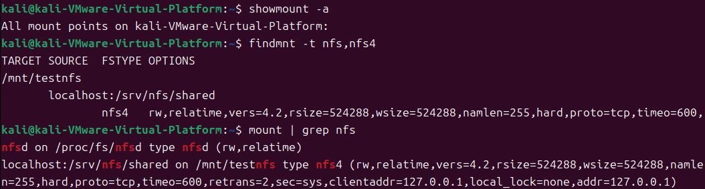

# **HW2**
## **測試環境**
使用 vmware 架設虛擬機進行測試，系統版本如下：
- Ubuntu 24.04.2 LTS (Noble Numbat)
- Debian
- CentOS Stream release 10 (Coughlan)
- FreeBSD 14.1-RELEASE

使用帳號設定如下：
- kali:kali（所以會看到 kali 到處出現，！並不是在 kali 系統測試！）  
- root:root (Debian/Ubuntu 和 FreeBSD)
- root:iamroot (CentOS)

## **Linux 系統取證指令**
圖片儘可能以 Ubuntu（紫底）, Debian（白底）, CentOS（深灰底）, FreeBSD（黑底） 順序呈現

### **網路資訊**
1. **列出所有正在監聽的 TCP/UDP 埠及其相關程序**
   - `ss -tulnp`（Debian/Ubuntu 和 CentOS）  
    .png)  
    .png)  
    .png)  
1. **列出所有網路連線及其相關程序**
   - `ss -anlp`（Debian/Ubuntu 和 CentOS）  
    .png)  
    .png)  
    .png)  
   - `sockstat -4 -6`（FreeBSD）  
    .png)  

2. **列出所有使用網路的文件描述符**
   - `lsof -i`（Debian/Ubuntu 和 CentOS）  
    .png)  
    .png)  
    .png)  
   - `fstat | grep -i internet`（FreeBSD）  
   .png)  

3. **顯示網路介面及其 IP 配置**
   - `ip a`（Debian/Ubuntu 和 CentOS）  
     .png)  
     .png)  
     .png)  
   - `ifconfig -a`（FreeBSD）  
      .png)  

4. **顯示路由表**
   - `ip route`（Debian/Ubuntu 和 CentOS）  
     .png)  
     .png)  
     .png)  
   - `netstat -rn`（FreeBSD）  
    .png)  

5. **檢查防火牆規則**
   - `ufw status verbose`（Debian/Ubuntu）  
   - `firewall-cmd --list-all`（CentOS）  
    
    .png)  
   - `pfctl -sr`（FreeBSD；有可能沒有）  
   - `ipfw list`（FreeBSD；有可能沒有）  
    
    .png)  
   - `iptables -L -v -n`（Debian/Ubuntu 和 CentOS）  
    
    .png)  
    
    .png)  
    
    （測試用 Debian 都沒有裝）  

6. **顯示當前登入的使用者**
   - `who`（Debian/Ubuntu、CentOS 和 FreeBSD）  
    .png)  
    .png)  
   - `w`（FreeBSD）  
    
    .png)  

### **共享資料夾與網路資源**
在進行 Windows 和 Linux 系統的取證時，兩者在共享資源的管理與取證方式上存在顯著差異。Windows 系統內建了 `net session`、`net share` 和 `net use` 等命令行工具，能直接檢視和管理共享資源及連線狀態，這些工具依賴於 SMB 和 NetBIOS 協議。

而在 Linux 系統中，類似的功能也能依賴於 Samba 套件和 SMB 協議，但需要確認系統是否安裝或啟用了相關服務（如 Samba Server 或 SMB 客戶端）  。若系統未啟用共享功能，則不會有相關的日誌或紀錄。此外，Linux 系統也常使用 NFS（Network File System）  作為內部網路的共享協定，其配置與取證方式也與 SMB 不同。

因此，在 Linux 系統的取證過程中，需先確認是否存在共享資源，並根據具體情況選擇適當的工具進行分析。

#### **共享資料夾／網路資源環境配置（以Ubuntu為例）  **
因為Linux默認沒有啟用共享資料夾／網路資源，所以要測試是否能取證要先在機器上另外配置。因為比較麻煩，所以這個部分（包含後續指令）  只拿 Ubuntu 做為例子：

   1. **安裝並設定 Samba**
      - 安裝 Samba：`sudo apt update && sudo apt install samba -y`
      - 建立共享資料夾 `/srv/samba/shared`，設定權限並編輯 `/etc/samba/smb.conf`，新增以下內容：
        ```
        [Shared]
           path = /srv/samba/shared
           browseable = yes
           read only = no
           guest ok = yes
           force user = nobody
        ```
          
      - 重新啟動 Samba 並設定開機自動啟動：`sudo systemctl restart smbd && sudo systemctl enable smbd`

   2. **安裝並設定 NFS**
      - 安裝 NFS Server：`sudo apt update && sudo apt install nfs-kernel-server -y`
      - 建立共享資料夾 `/srv/nfs/shared`，設定權限並編輯 `/etc/exports`，新增以下內容：
        ```
        /srv/nfs/shared 192.168.1.0/24(rw,sync,no_subtree_check)
        ```
          
      - 套用設定並啟動 NFS：`sudo exportfs -ra && sudo systemctl restart nfs-server`

   3. **模擬掛載測試**
      - 使用 CIFS 掛載 Samba：`sudo mount -t cifs //localhost/Shared /mnt/smbtest -o guest`
      - 使用 NFS 掛載共享：`sudo mount -t nfs localhost:/srv/nfs/shared /mnt/testnfs`
  
#### **指令**
1. **檢查 Samba 服務的狀態**
   - `systemctl status smbd`（Debian/Ubuntu）  
   - `systemctl status smb`（CentOS）  
   - `service samba_server onestatus`（FreeBSD）  
     
2. **複製 Samba 配置文件**
   - `cp /etc/samba/smb.conf`（Debian/Ubuntu 和 CentOS）  
   - `[ -f /usr/local/etc/smb4.conf ] && cp /usr/local/etc/smb4.conf`（FreeBSD）  
     
3. **顯示 Samba 當前的連線狀態**
   - `smbstatus`（Debian/Ubuntu、CentOS 和 FreeBSD）  
     
4. **檢查是否掛載 CIFS/NFS/SSHFS/WebDAV 網路檔案系統**
   - `mount | grep -E 'type (cifs|nfs)'`（Debian/Ubuntu 和 CentOS）  
   - `mount | grep -E 'smbfs|nfs|sshfs|webdav'`（FreeBSD）  
     
5. **檢查常見分享服務埠是否開啟**
   - `ss -tuln | grep -E ':445|:139'`（Debian/Ubuntu）  
   - `ss -tuln | grep -E ':445|:139|:2049'`（CentOS）  
   - `sockstat -4 -6 | grep -E ':(445|139|2049)'`（FreeBSD）  
     
6. **複製 NFS 共享配置文件**
   - `cp /etc/exports`（Debian/Ubuntu 和 CentOS）  
   - `[ -f /etc/exports ] && cp /etc/exports`（FreeBSD）  
      

7. **檢查 NFS 伺服器狀態**
   - `systemctl status nfs-server`（Debian/Ubuntu 和 CentOS）  
   - `service nfsd onestatus`（FreeBSD）  

8. **顯示 NFS 共享的詳細資訊**
   - `exportfs -v`（Debian/Ubuntu 和 CentOS）  
   - `showmount -a`（Debian/Ubuntu、CentOS 和 FreeBSD）  
     

9. **檢查本機是否掛載 NFS 共享**
   - `findmnt -t nfs,nfs4`（Debian/Ubuntu 和 CentOS）  
   - `mount | grep nfs`（FreeBSD）  
     

### **程序與排程**
1. **列出所有正在執行的程序**
   - `ps aux`（Debian/Ubuntu、CentOS 和 FreeBSD）  
     .png)  
     .png)  
     .png)  
     .png)  

2. **顯示系統當前的資源使用狀況**
   - `top -b -n 1`（Debian/Ubuntu 和 CentOS）  
     .png)  
     .png)  
     .png)  
   - `top -b`（FreeBSD）  
     .png)  

3. **列出所有啟用的服務**
   - `systemctl list-unit-files --type=service`（Debian/Ubuntu 和 CentOS）  
     .png)  
     .png)  
     .png)  
   - `service -e`（FreeBSD）  
     
     .png)  

4. **顯示排程任務**
   - `crontab -l`（Debian/Ubuntu、CentOS 和 FreeBSD）  
     .png) 

     .png)  
   - `cat /etc/crontab`（Debian/Ubuntu、CentOS 和 FreeBSD）  
     .png)  
     .png)  
     .png)  
     .png)  
     

5. **列出排程目錄**
   - `ls /etc/cron*`（Debian/Ubuntu 和 CentOS）  
     .png)  
     .png)
       
     .png)  
   - `ls /usr/local/etc/periodic/{daily,monthly,security,weekly}`（FreeBSD）  
     .png)  
     .png)  
     .png)  
   - `ls /etc/periodic/{daily,monthly,security,weekly}`（FreeBSD）  
     .png)  
     .png)  
     .png)  
     .png)  

6. **查找可疑的腳本文件**
   - `find / -type f \( -name "*.exe" -o -name "*.bat" -o -name "*.cmd" \) -exec ls -al {}`（Debian/Ubuntu 和 CentOS）  
     .png)  
     .png)  
     .png)  
   - `find / -type f \( -name "*.sh" -o -name "*.pl" -o -name "*.py" \) -exec ls -al {}`（FreeBSD）  
     .png)   

### **系統資訊**
1. **顯示系統內核及架構資訊**
   - `uname -a`（Debian/Ubuntu、CentOS 和 FreeBSD）  
     .png)  
     .png)  
     .png)  
     .png)  

2. **顯示作業系統版本資訊**
   - `cat /etc/os-release`（Debian/Ubuntu）  
     .png)  
     .png)  
   - `cat /etc/centos-release`（CentOS）  
     
     .png)  
   - `freebsd-version`（FreeBSD）  
     
     .png)  

3. **顯示系統運行時間**
   - `uptime`（Debian/Ubuntu、CentOS 和 FreeBSD）  
     .png)  
     .png)  
     .png)  
     .png)  

4. **顯示系統時間**
   - `timedatectl`（Debian/Ubuntu 和 CentOS）  
     .png)  
     .png)  
     
     .png)  
   - `date`（FreeBSD）  
   
      .png)  

5. **顯示內核版本與硬體資訊**
   - `sysctl kern | grep -i version`（FreeBSD）  
     
     .png)  
   - `sysctl hw.model hw.ncpu hw.physmem`（FreeBSD）  
     
     .png)  

6. **列出已安裝的軟體包**
   - `dpkg -l`（Debian/Ubuntu）  
     .png)  
     .png)  
   - `yum list installed`（CentOS）  
     .png)  
   - `pkg info`（FreeBSD）  
     .png)  

### **使用者與帳號**
1. **顯示當前使用者資訊**
   - `id`（Debian/Ubuntu、CentOS 和 FreeBSD）  
     .png)  
     .png)  
   - `whoami`（Debian/Ubuntu、CentOS 和 FreeBSD）  
     
     .png)  
     .png)  
     .png)  
     .png)  

2. **顯示系統的使用者與群組資訊**
   - `cat /etc/passwd`（Debian/Ubuntu、CentOS 和 FreeBSD）  
     .png)  
     .png)  
     .png)  
     .png)  
   - `cat /etc/group`（Debian/Ubuntu、CentOS 和 FreeBSD）  
     .png)  
     .png)  
     .png)  
     .png)  

3. **顯示所有使用者與群組資訊**
   - `pw user show -a`（FreeBSD）  
   .png)  
   - `pw group show -a`（FreeBSD）  
  
   .png)  

### **系統日誌**
1. **顯示系統日誌**
   - `journalctl -xe`（Debian/Ubuntu 和 CentOS）  
     .png)  
     .png)  
     .png)  
   - `tail -n 200 /var/log/messages`（CentOS 和 FreeBSD）  
      .png)  
      .png)  

2. **顯示身份驗證日誌**
   - `[ -f /var/log/auth.log ] && tail -n 200 /var/log/auth.log`（Ubuntu 和 FreeBSD）  
     .png)  
     .png)  
   - `[ -f /var/log/secure ] && tail -n 200 /var/log/secure`（CentOS）  
     .png)  

3. **顯示安全日誌**
   - `[ -f /var/log/security ] && tail -n 200 /var/log/security`（FreeBSD）  
      .png)  
4. **顯示內核日誌**
   - `dmesg | tail -n 200`（Debian/Ubuntu、CentOS 和 FreeBSD）  
     .png)  
     .png)  
     .png)  
     .png)  

## **自動腳本**

   使用 ChatGPT ＋ Github Copilot（GPT-4o）  幫忙將上述所有指令整合成 bash 腳本（.sh script in FreeBSD）  
   
   `collect_ubuntu_debian.sh` 因為他們比較接近，將這兩個系統寫在一起
   .png)  
   `collect_centos.sh`
   .png)  
   `collect_freebsd.sh`
   .png)  

   另外寫了一個腳本可以偵測系統，自動選擇腳本（目前 FreeBSD 無法偵測）  

     

### **使用方法**

1. 將所有腳本 `chmod +x`
2. 以 root 權限執行 `./auto_collect.sh`
3. 輸出檔案將存在 `/path/of/your/script/{OS_name}_{DateTime}` 中

輸出檔案會存在子資料夾：
- [net](#網路資訊)
   - [net/share](#共享資料夾與網路資源)（若有開啟或掛載 smb 或 nfs）  
- [process](#程序與排程)
- [system](#系統資訊)
- [account](#使用者與帳號)
- [log](#系統日誌)

### **執行腳本**

（以 Ubuntu 為例）  
.png)  
`./debian_ubuntu_info_20250407_191801`
.png)  
`./debian_ubuntu_info_20250407_191801/net`
.png)  
`./debian_ubuntu_info_20250407_191801/net/share`
.png)  
`./debian_ubuntu_info_20250407_191801/process`
.png)  
`./debian_ubuntu_info_20250407_191801/system`
.png)  
`./debian_ubuntu_info_20250407_191801/account`
.png)  
`./debian_ubuntu_info_20250407_191801/log`
.png)  